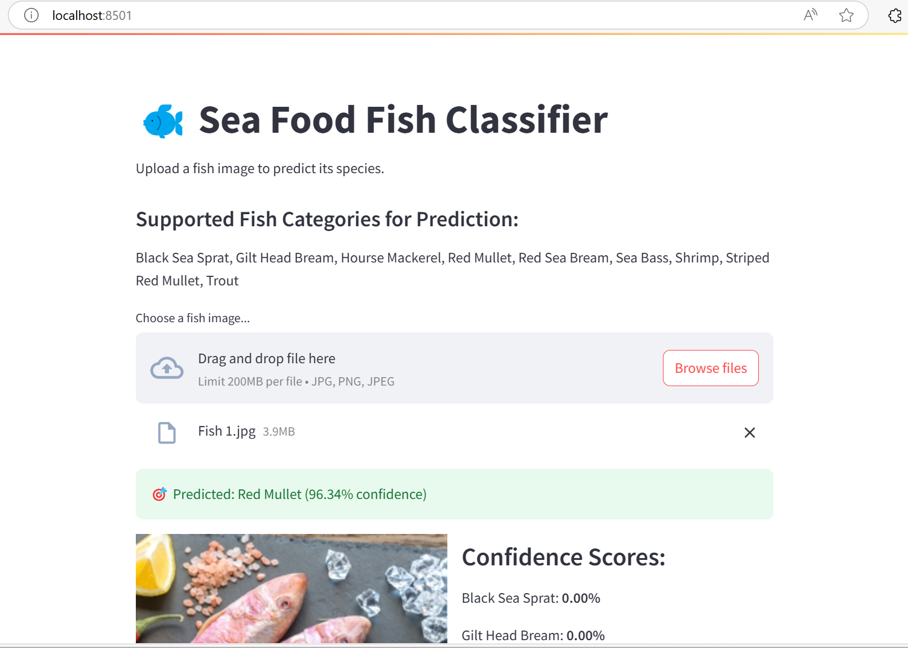
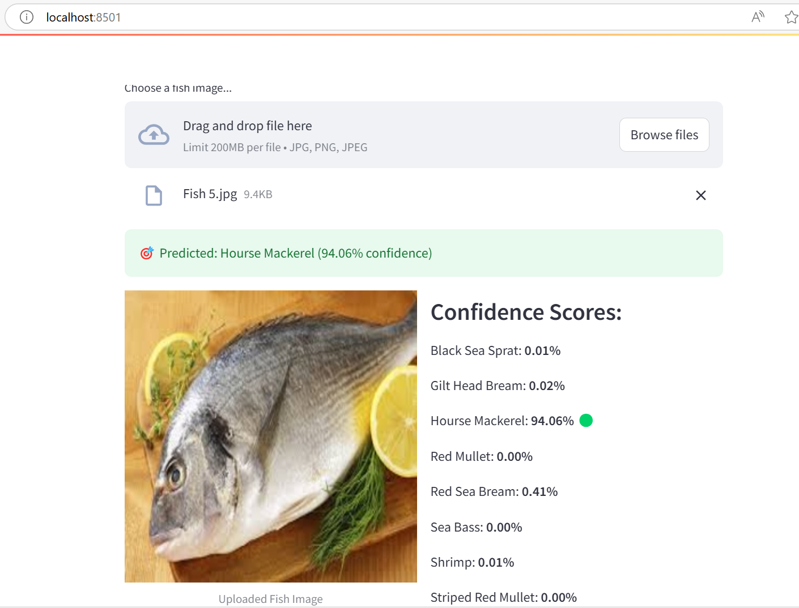

# 🐟 Fish Species Classification with Deep Learning

A deep learning-based image classification project to recognize and classify different fish species using both custom and pre-trained CNN models, deployed via a sleek and interactive **Streamlit web app**.

## 🔍 Overview

This project demonstrates how to:
- Build a custom CNN model and fine-tune pre-trained models like VGG16, ResNet50, MobileNet, InceptionV3, and EfficientNetB0.
- Train and evaluate models on a fish species dataset.
- Deploy a user-friendly **Streamlit web app** to allow users to upload fish images and view real-time predictions with confidence scores.

---

## 📁 Project Structure

```
├── fish_classification.ipynb     # Model training and evaluation notebook
├── Fish_classify.py              # Streamlit app for inference
├── images/                       # Screenshots
├── models/                       # Folder to store trained .h5 model files
├── requirements.txt              # Required libraries
└── README.md                     # You're here!
```

---

## 🐠 Dataset

- The dataset contains images of 9 fish classes.
- trained images were studio-captured (blue background).
- Classes include:
  - `fish sea_food black_sea_sprat`
  - `fish sea_food gilt_head_bream`
  - `fish sea_food hourse_mackerel`
  - `fish sea_food red_mullet`
  - `fish sea_food red_sea_bream`
  - `fish sea_food sea_bass`
  - `fish sea_food shrimp`
  - `fish sea_food striped_red_mullet`
  - `fish sea_food trout`

---

## 🧠 Model Training (📓 `fish_classification.ipynb`)

- **Custom CNN**: Built from scratch using Keras.
- **Pre-trained Models**:
  - VGG16
  - ResNet50
  - MobileNet --> Found as best model with highest accuracy and used in Final app.
  - InceptionV3
  - EfficientNetB0

All models are trained with `categorical_crossentropy` and `Adam` optimizer for 10 epochs. Final accuracies are saved and compared.

Saved using:
```python
model.save('Fish_models/MobileNet_best.h5')  # or any other model
```

---

## 🌐 Streamlit Web App (▶️ `Fish_classify.py`)

### 🔧 Features
- Upload any fish image for prediction.
- View the predicted class above the image.
- See all confidence scores next to the image.
- Highlights the highest score if it exceeds 50%.

### ▶️ To Run the App

1. Clone the repo:
   ```bash
   git clone https://github.com/santhanvasudevan/Sea_Food_Fish_Classification.git
   cd Sea_Food_Fish_Classification
   ```

2. Install requirements:
   ```bash
   pip install -r requirements.txt
   ```

3. Run the app:
   ```bash
   streamlit run Fish_classify.py
   ```

---

## 🖼️ Screenshots




---



---

## 💡 Improvements

- Expand dataset with more varied and balanced fish images.
- Deploy the app online (Streamlit Cloud / Hugging Face Spaces).

---

## 🛠️ Tech Stack

- Python 🐍
- TensorFlow / Keras 🧠
- Streamlit 🌐
- Google Colab 🚀

---

## 📜 License

This project is under the [MIT License](LICENSE).

---

## 🙌 Acknowledgements

- Thanks to open fish image datasets and contributors.
- Special thanks to Google Colab for compute!

